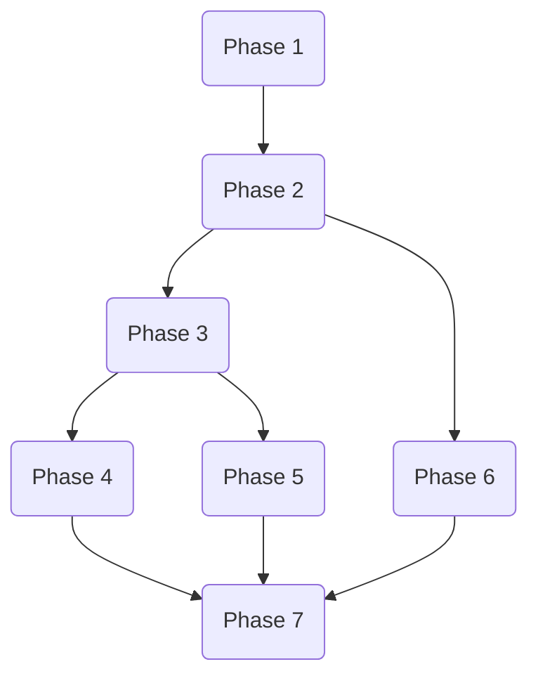

# Implementation Tasks: AWS Cost Explorer Plugin for PulumiCost

**Feature**: AWS Cost Explorer Plugin for PulumiCost
**Source**: `specs/001-aws-ce-plugin/plan.md`
**Status**: Pending

## Phase 1: Setup
*Goal: Initialize project dependencies and environment.*

- [x] T001 Verify project structure and `go.mod` dependencies (aws-sdk-go-v2) in `go.mod`
- [x] T002 Configure `Makefile` for build and test commands in `Makefile`

## Phase 2: Foundational
*Goal: Implement core data models, caching, and infrastructure.*

- [x] T003 Implement `CostEntry`, `ResourceDescriptor`, `DateRange` structs in `internal/pricing/data.go`
- [x] T004 Implement `ReservationData`, `CacheEntry` structs in `internal/pricing/data.go` (Verify `FallbackHint` availability in SDK)
- [x] T005 [P] Implement `CacheManager` with hybrid memory/disk logic in `internal/pricing/cache.go`
- [x] T006 [P] Implement exponential backoff retry utility in `internal/client/retry.go`
- [x] T007 Update `CostResult` in `internal/client/client.go` to match `CostEntry` requirements

## Phase 3: User Story 1 - Retrieve Historical Billing Data (P1)
*Goal: Retrieve actual cost data from AWS Cost Explorer.*

- [x] T008 [US1] Update `GetResourceCost` in `internal/client/client.go` to support `DateRange` and `Granularity`
- [x] T026 [US1] Implement pagination logic in `internal/client/client.go` to handle `NextPageToken`
- [x] T009 [US1] Implement `GetActualCost` in `internal/pricing/calculator.go` to use `client.GetResourceCost`
- [x] T010 [US1] Map AWS response to `[]CostEntry` in `internal/pricing/calculator.go`
- [x] T011 [US1] Implement `GetProjectedCost` in `internal/pricing/calculator.go` to return `FallbackHint.RECOMMENDED`
- [x] T012 [US1] Integrate `CacheManager` into `GetActualCost` flow in `internal/pricing/calculator.go`

## Phase 4: User Story 2 - Query Costs by Dimensions (P2)
*Goal: Group and filter costs by service, account, tags, and AZ.*

- [x] T013 [P] [US2] Update `client.go` to support generic dimension grouping in `internal/client/client.go`
- [x] T014 [US2] Update `GetActualCost` in `internal/pricing/calculator.go` to pass dimensions to client
- [x] T015 [P] [US2] Implement `GetServiceActualCost` using generic client method in `internal/pricing/calculator.go`
- [x] T016 [P] [US2] Implement `GetAccountActualCost` using generic client method in `internal/pricing/calculator.go`

## Phase 5: User Story 3 - View Reserved Instance/Savings Plan Discounts (P3)
*Goal: See impact of RIs and SPs.*

- [x] T017 [US3] Add `GetReservationUtilization` method to `internal/client/client.go`
- [x] T018 [US3] Add `GetSavingsPlanCoverage` method to `internal/client/client.go`
- [x] T019 [US3] Update `GetActualCost` response to populate `reservation_arn`/`savings_plan_arn` in `internal/pricing/calculator.go`

## Phase 6: User Story 4 - Handle API Rate Limits Gracefully (P4)
*Goal: robust retry logic.*

- [x] T020 [US4] Integrate `retry.go` logic into all `client.go` API calls in `internal/client/client.go`
- [x] T021 [US4] Verify error mapping for RateLimitExceeded in `internal/client/client.go`

## Phase 7: Polish & Cross-Cutting
*Goal: Logging, security, and final verification.*

- [x] T022 Implement zero-log structured logging in `internal/pricing/calculator.go`
- [x] T023 Implement input validation for `ResourceDescriptor` and `DateRange` in `internal/pricing/calculator.go`
- [x] T024 Verify strict read-only permission checks in `internal/client/client.go`
- [x] T025 Run full suite of unit tests for `internal/pricing/` and `internal/client/`

## Dependencies

## Parallel Execution Opportunities

- **T005 (Cache)** and **T006 (Retry)** are independent.
- **T013 (Client Generic Dims)** can be done alongside **T014 (Calculator Dims)**.
- **T015 (Service Cost)** and **T016 (Account Cost)** are parallelizable.

## Implementation Strategy
Start with **Phase 2** to establish the data structures and caching layer. Then move to **Phase 3** to get the basic "Happy Path" of fetching costs working. **Phase 4** extends this with grouping, which is critical for the "Finance" persona. **Phase 5** and **Phase 6** add depth and reliability.
